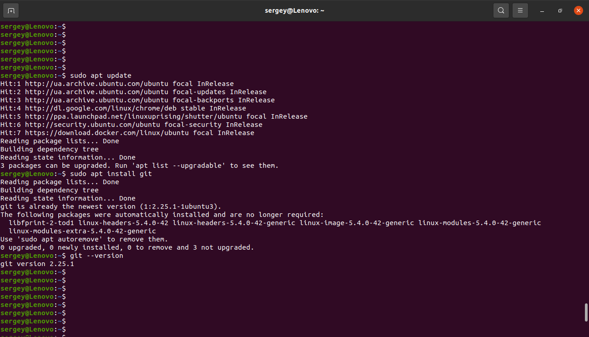
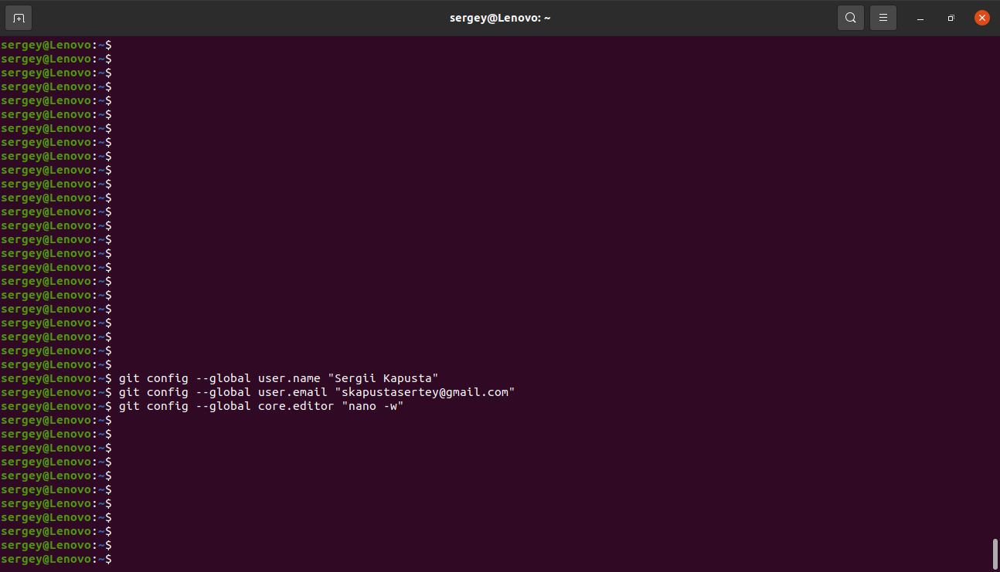
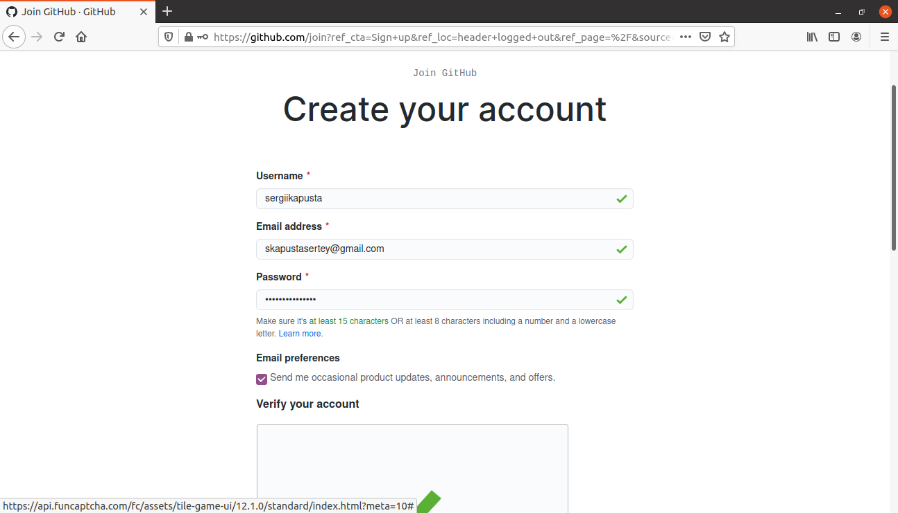
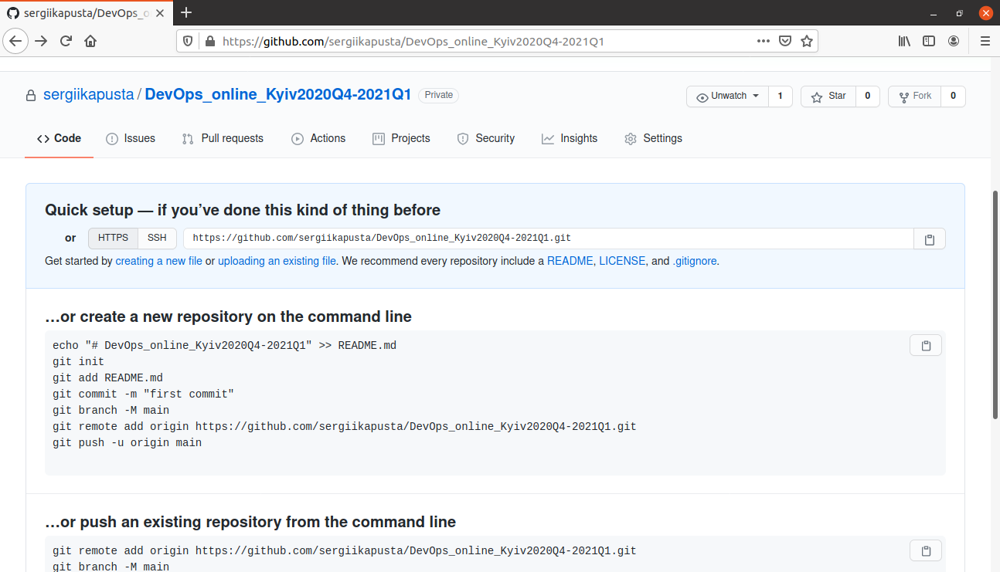
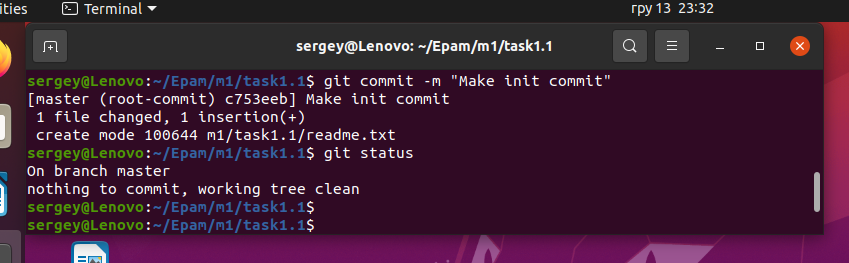
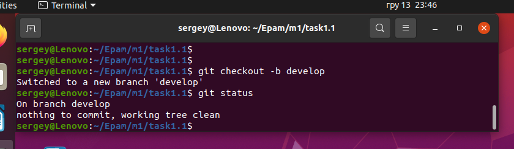
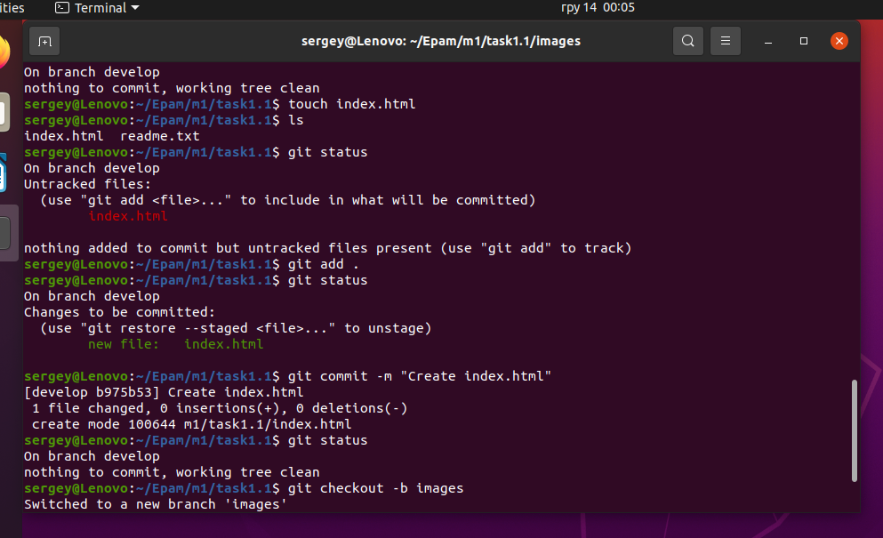

# Module 1  DevOps Introduction
# TASK 1.1

## 1. Install GIT

## 2. Setup GIT

## 3. Create account on GitHub

## 4. Create new private repo on GitHub

## 10. Make init commit

## 11. Create develop branch and chekout

## 11-13Create index.html, Create brabch Image

## log

