# Module 2 Virtualization and Cloud Basic
# TASK 2.1

## CloneVM1

## Configure the USB
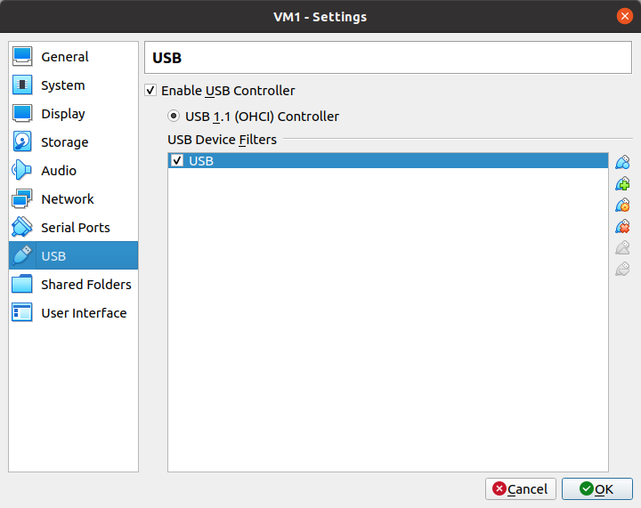
## Create a group, Snapshts
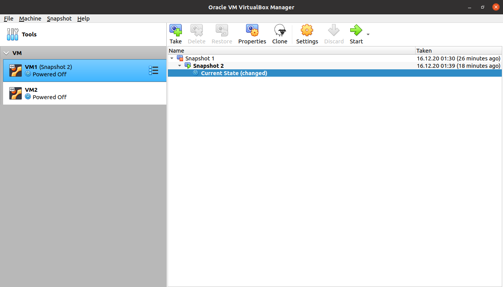
## Export VM1
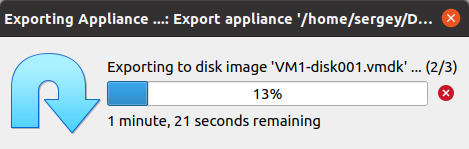
##Import VM
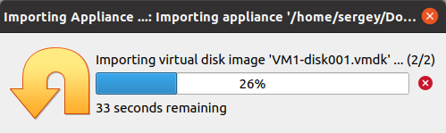
## VBoxManage list vms
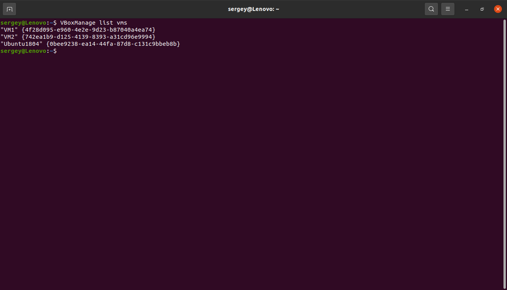
## Table of possible connections
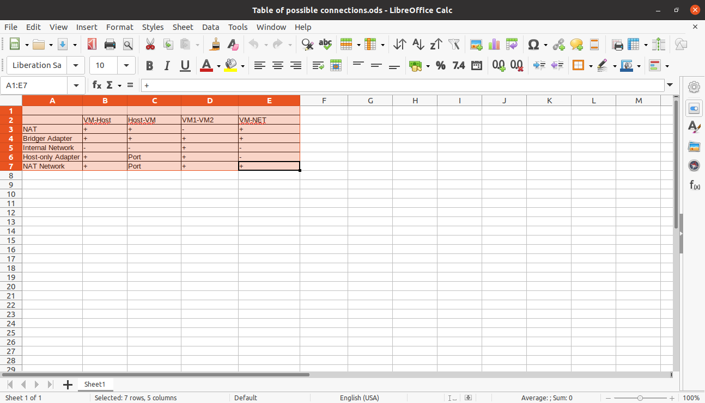
## Shared folder
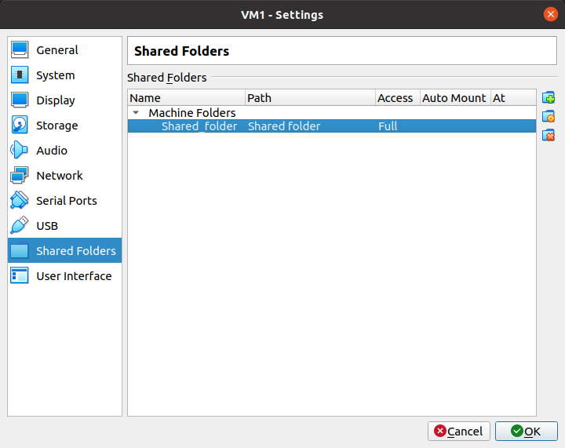
## VMBoxManage showvminfo
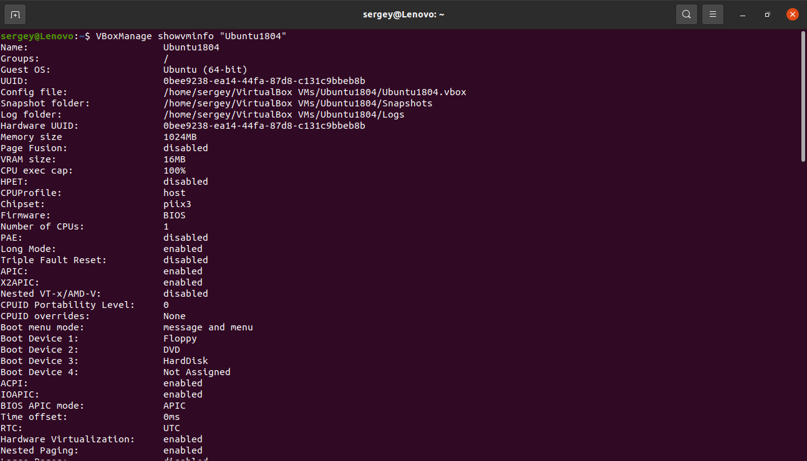
## Vagrant init
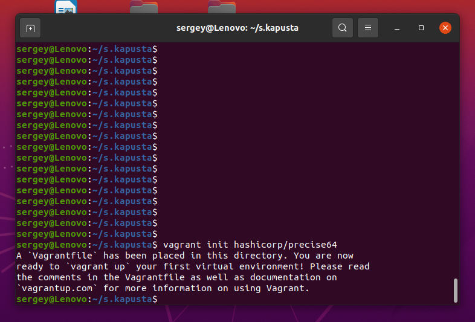
## Vagrant built
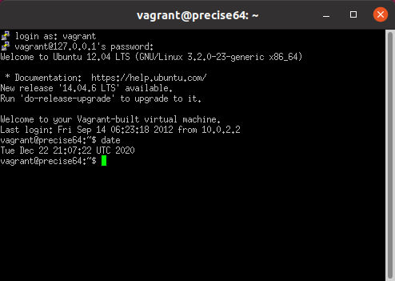
## PuTTY
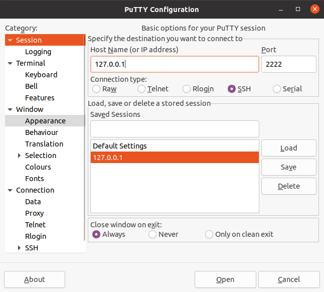
## Vagrant up
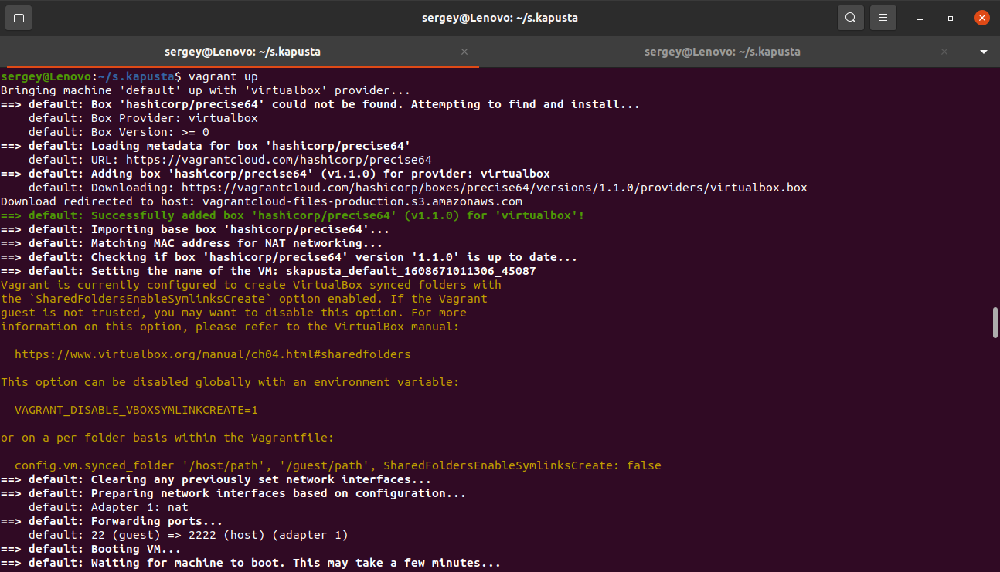
## Stop and delete the created VM
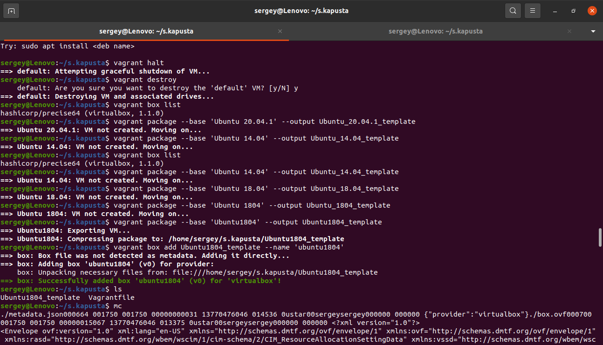
## Created
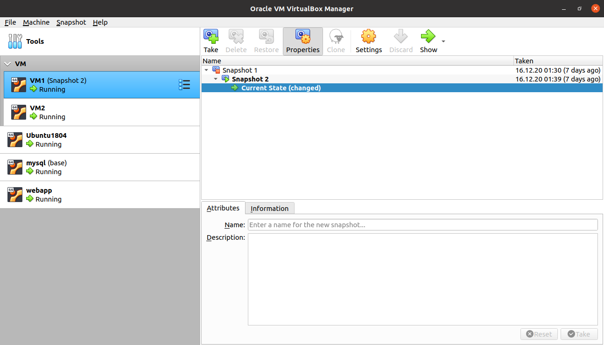
## Create a test environment from a few servers
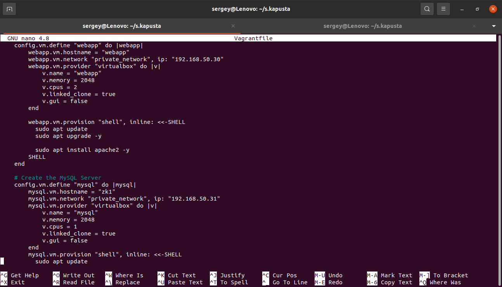
