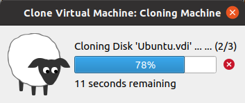

# Module 2 Virtualization and Cloud Basic
# TASK 2.1

##CloneVM1

##Configure the USB
s2.png
##reate a group, Snapshts
s3.png
##Export VM1
s4.png
##Import VM
s5.png
##VBoxManage list vms
s6.png
Table of possible connections
s7.png
Shared folder
s8.png
VMBoxManage showvminfo
s9.png
Vagrant init
s10.png
Vagrant built
s11.png
PuTTY
s12.png
Vagrant up
s13.png
Stop and delete the created VM
s14.png
Created
s15.png
Create a test environment from a few servers
s16.png
