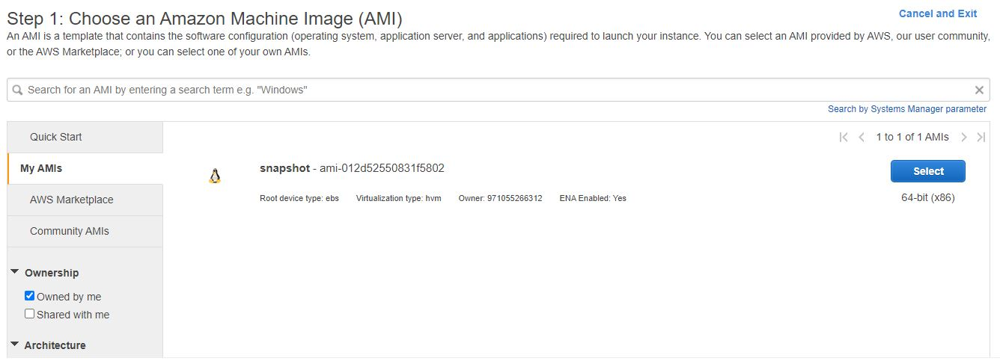

# Module 2 Virtualization and Cloud Basic
# TASK 2.2

## Create an instance

## Select your instance location

## Ssh connect

## Instances

## Create image

## Snapshot

## Create Disk_D

## mount Disk_D 

## Create a snapshot of your instance to keep as a backup

## Create and save some file on Disk_D

## start WordPress

## Welcome to WordPress

## Static IP adress

## Create bucket

## Upload bucket

## Delete objects

## Delete bucket

## Add user

## Configure CLI AWS and upload any files to S3

## Deploy Docker Containers on Amazon ECS

## Amazon ECS

## Create a static website on Amazon S3

## Error

## Links
[alt text](http://skapysta.com.s3-website.eu-central-1.amazonaws.com/
[alt text](http://skapysta.com.s3-website.eu-central-1.amazonaws.com/error.html

