# Module 3 Database Administration
# TASK 3.1

## install mysql-server
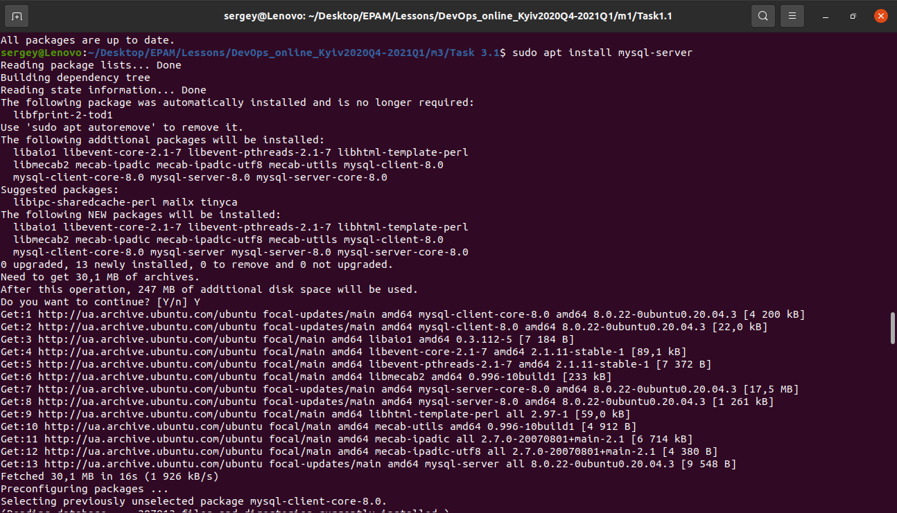
## describe the database schema
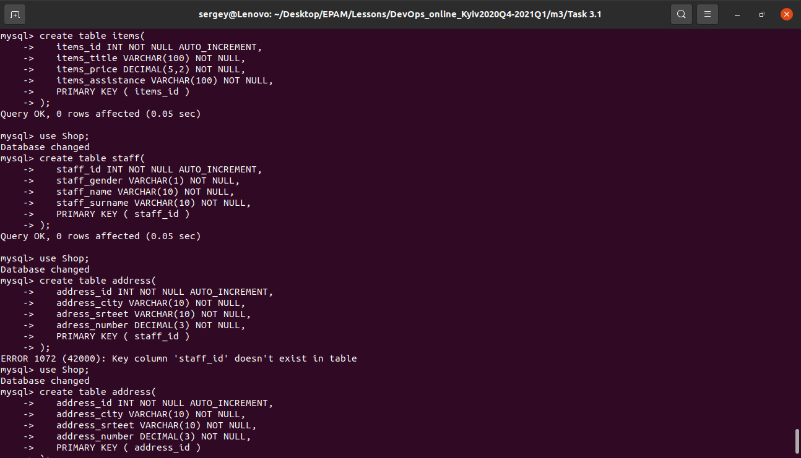
## Fill in tables
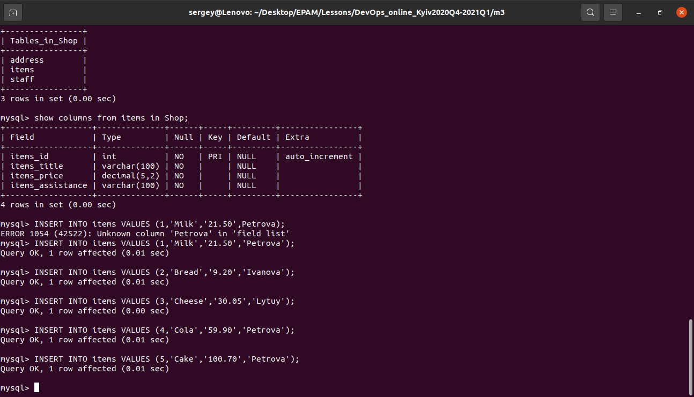
## Construct and execute SELECT operator with WHERE, GROUP BY and ORDER BY
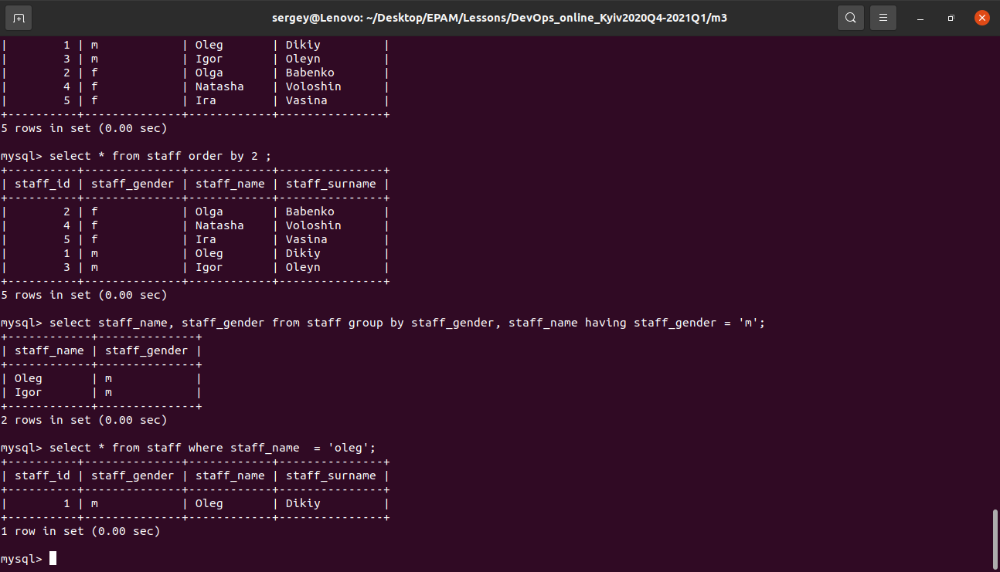
## DDL
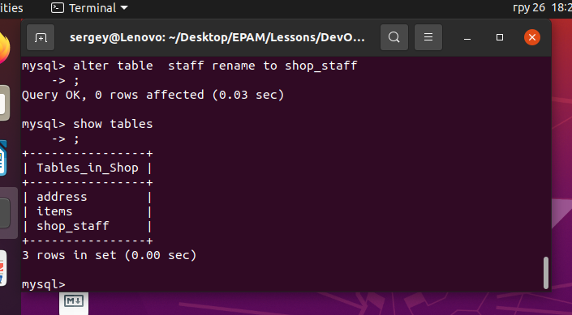
## DML-Update
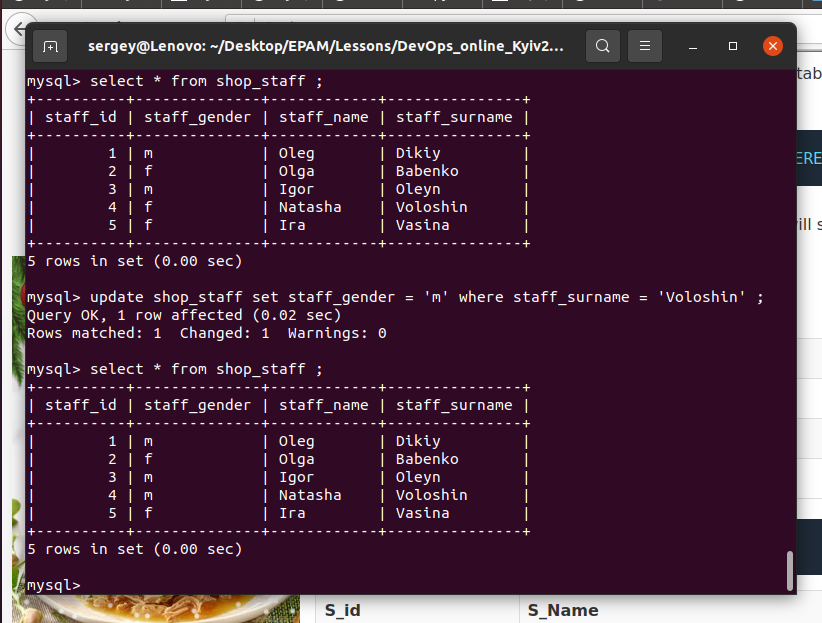
## DCL
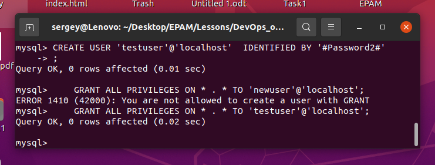
## SHOW GRANTS FOR user@localhost
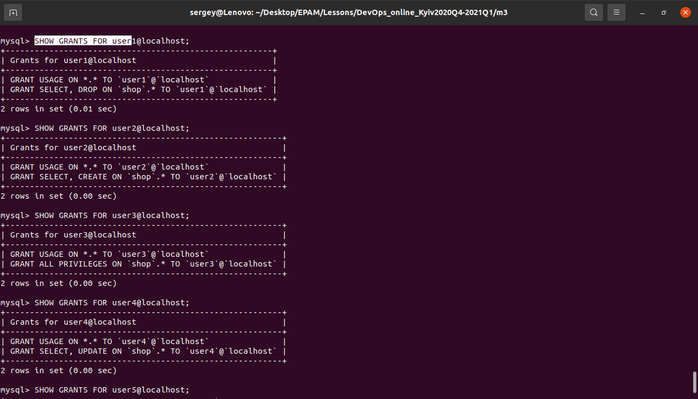
## Connect to the database as a new user and verify that the privileges allow or deny certain actions
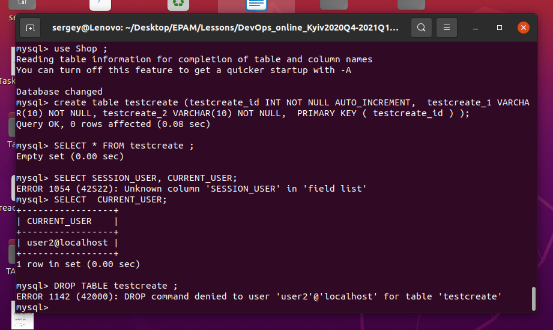
## selection from the main table DB MySQL
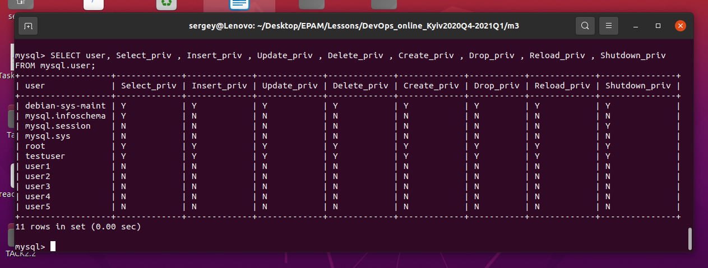
## selection from the main table DB MySQL

## Backup of your database
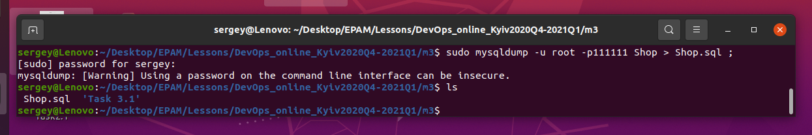
## Delete the table

## Restore database
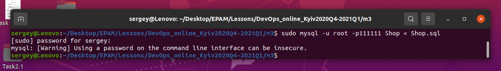
## Create an Amazon DynamoDB table

## Enter data into an Amazon DynamoDB table

## Query an Amazon DynamoDB table using Query and Scan

