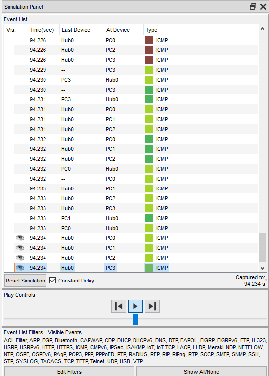

# Module 4 Virtualization and Cloud Basic
# TASK 4.1

## Project2

## ICMP5

## Simulation Panel6

## OSI7

## ICMP8

## Simulation Panel8

## OSI8

## Project9

## ICMP13

## Simulation Panel13

## OSI13

## ICMP17

## ICMP22

## Hub — пристрій фізичного рівня, з'єднувальний компонент, до якого підключають усі комп'ютери в мережі за топологією «зірка».
## Вони можуть відновлювати і ретранслювати сигнали. Пасивні концентратори лише передають сигнал з одного порту на всі інші.
## Концентратор використовують для об'єднання кількох пристроїв Ethernet у спільний сегмент мережі.
## Як елемент побудови мереж, їх майже не випускають — на зміну прийшли мережеві комутатори (свічі), 
## що виділяють кожен під'єднаний пристрій в окремий сегмент.

## Мере́жевий комута́тор або світч — пристрій, призначений для з'єднання декількох вузлів комп'ютерної мережі в межах одного сегмента.
## На відміну від концентратора, що поширює трафік від одного під'єднаного пристрою до всіх інших, комутатор передає дані лише безпосередньо отримувачу.
## Це підвищує продуктивність і безпеку мережі, рятуючи інші сегменти мережі від необхідності обробляти дані, які їм не призначалися.
## Для з'єднання декількох мереж на основі мережного рівня служать маршрутизатори.

## Маршрутиза́тор, або ро́утер — електронний пристрій, що використовується для поєднання двох або більше мереж і керує процесом маршрутизації.
## Маршрутизатор це мережевий пристрій, який підключається між локальною мережею й інтернетом. Маршрутизатор не обмежується простим 
## пересиланням даних між інтерфейсами, а також виконує й інші функції: захищає локальну мережу від зовнішніх загроз, обмежує доступ користувачів
## локальної мережі до ресурсів інтернету, роздає IP-адреси, шифрує трафік і багато іншого.
## Маршрутизатори працюють на мережевому рівні моделі OSI: можуть пересилати пакети з однієї мережі до іншої.
