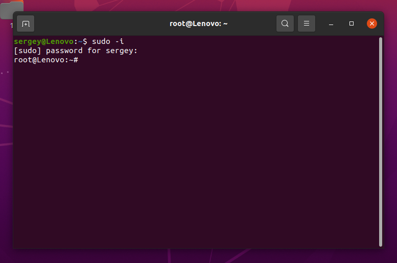
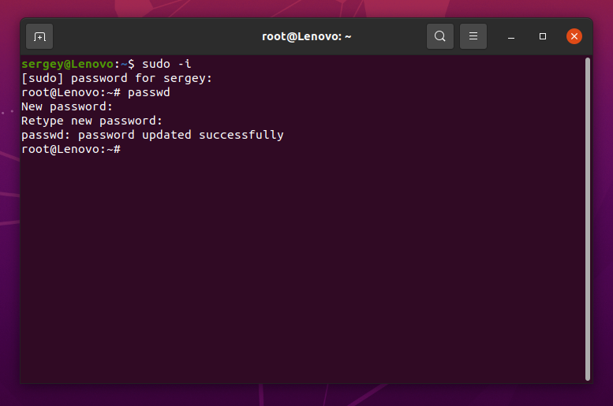
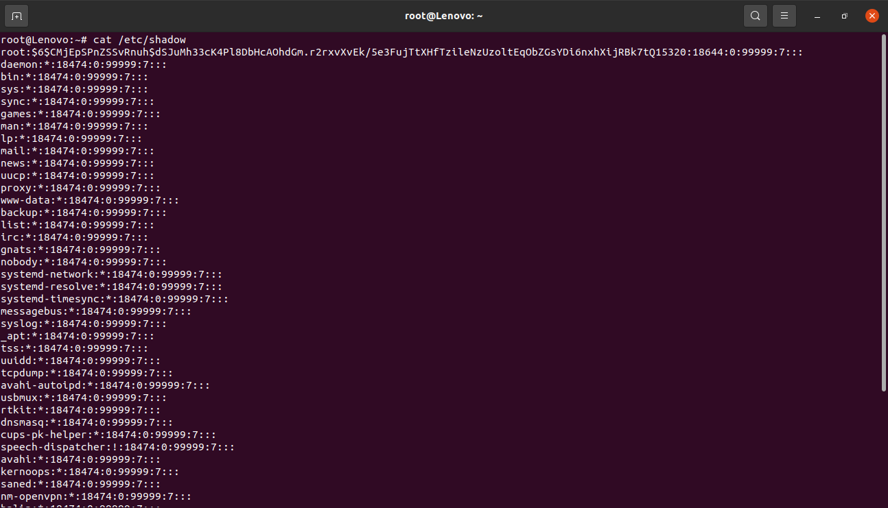
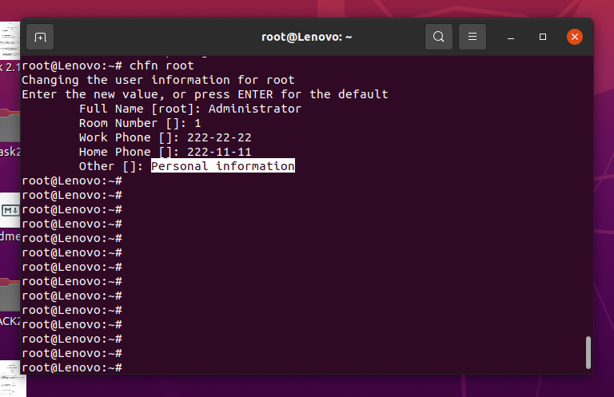
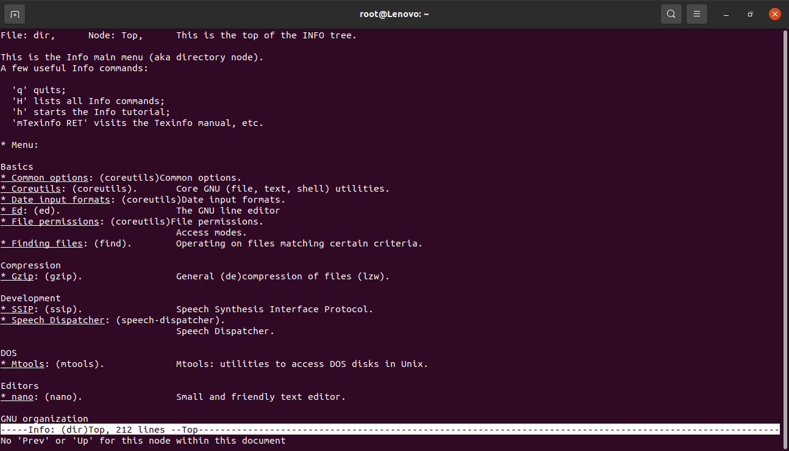
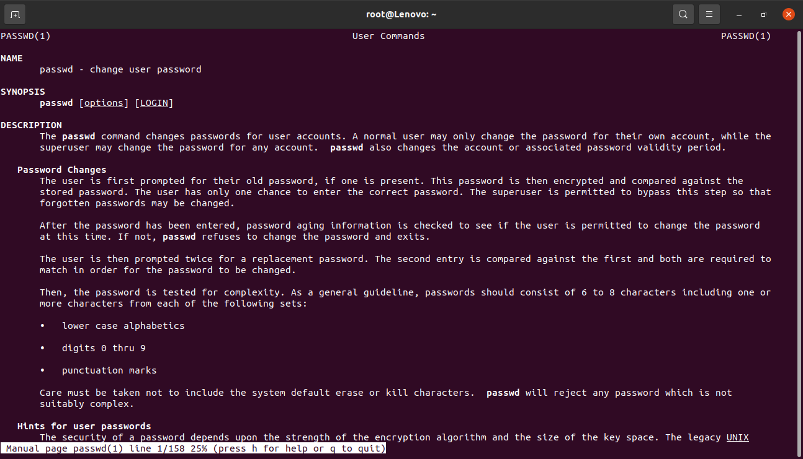
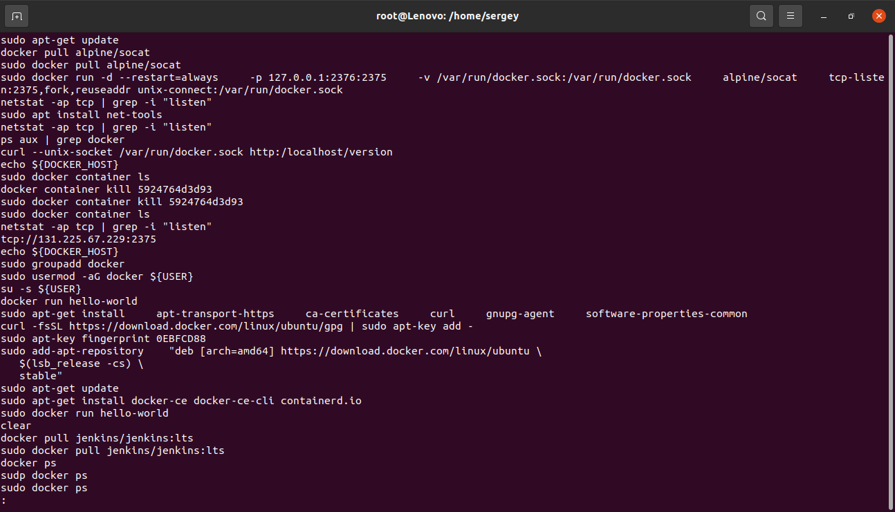
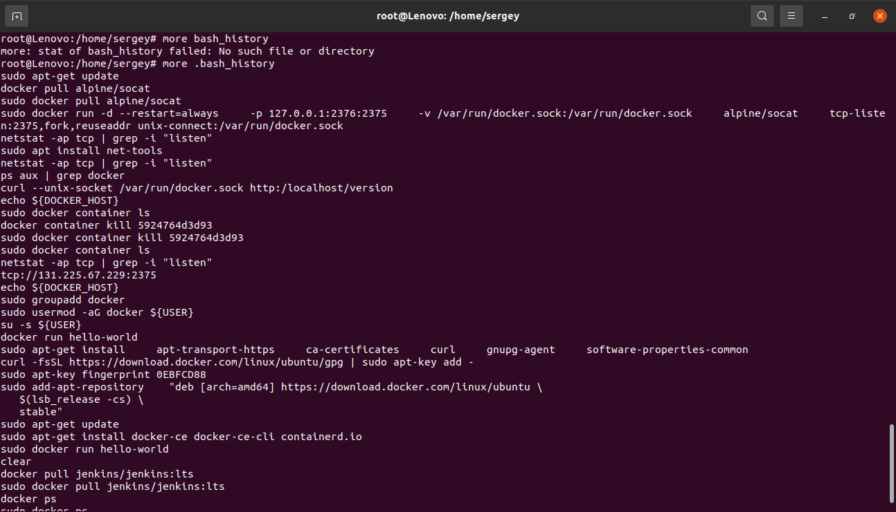
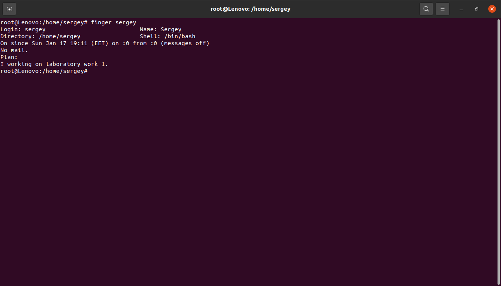
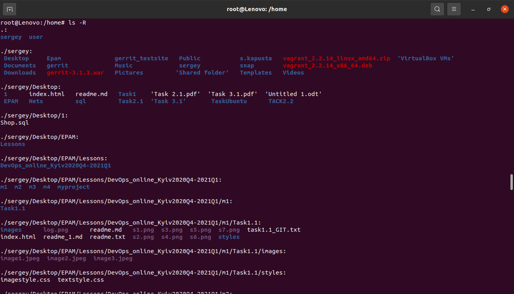

# Module 5 Linux
# TASK 5.1

## 1login as root

## 2passwd

## 2.etc/shadow
## 3users

## 4personal information

## 5info

## 5man

## passwd -d
## -d, --delete     Delete a user's password (make it empty). This is a quick way to disable a password for an account. It will set the named account passwordless.
## -l, --lock       Lock the password of the named account. This option disables a password by changing it to a value which matches no possible encrypted value (it adds a ´!´ at the beginning of the password).
## 6less

## 6more

## 7finger plan

## 8ls-R

