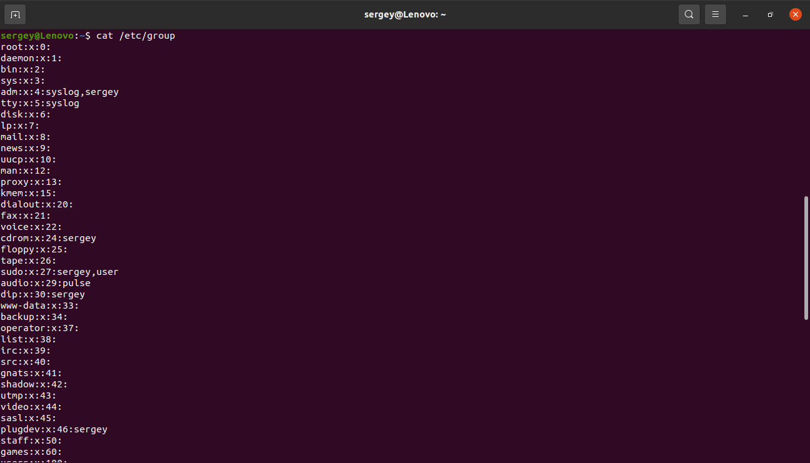
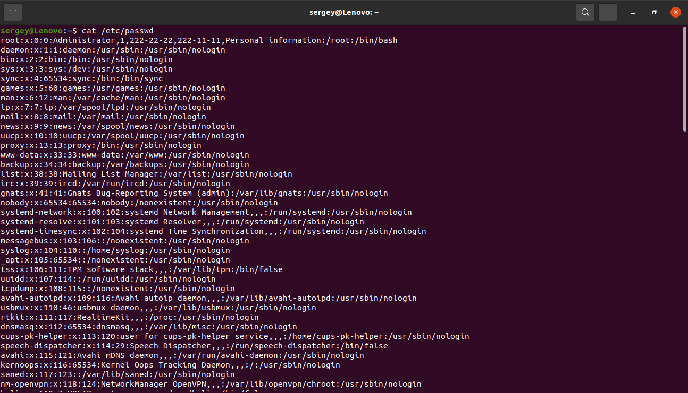
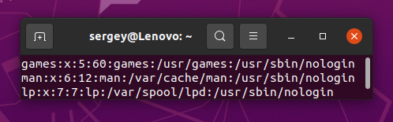
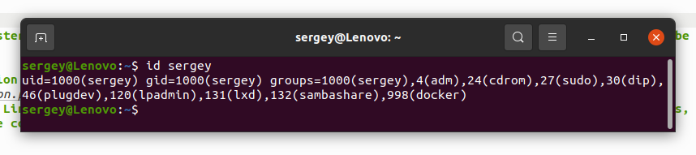
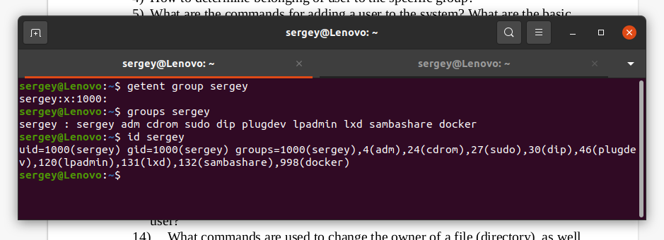
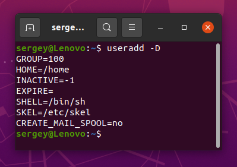
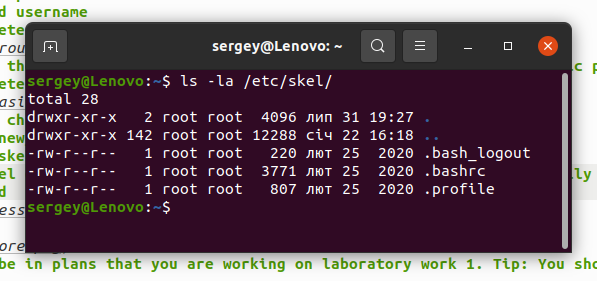
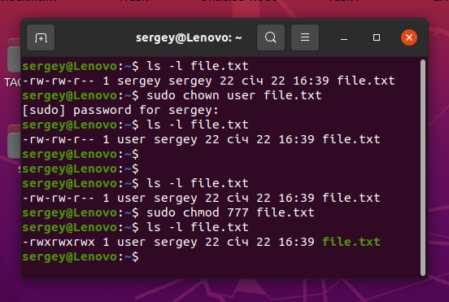
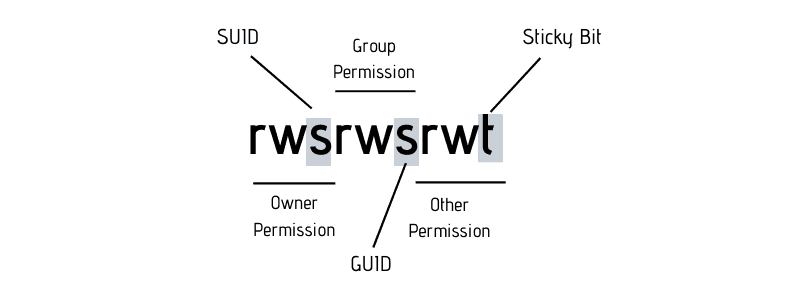

# Module 5 Linux
# TASK 5.2

## 1) Analyze the structure of the /etc/passwd and /etc/group file, what fields are present in it, what users exist on the system? Specify several pseudo-users, how to define them?

## 2) What are the uid ranges? What is UID? How to define it?
## Uid ranges 0-65535
## To define id username

## 3) What is GID? How to define it?
## GID is a group identifier
## To define id username 
## 4) How to determine belonging of user to the specific group?

## 5) What are the commands for adding a user to the system? What are the basic parameters required to create a user?
## basic parameters

## 6) How do I change the name (account name) of an existing user?
## usermod -l new_username old_username
## 7) What is skell_dir? What is its structure?
## The /etc/skel directory contains files and directories that are automatically copied over to a new user’s when it is created from useradd command

## 8) How to remove a user from the system (including his mailbox)?
## Command userdel -r
## 9) What commands and keys should be used to lock and unlock a user account?
## Lock passwd -l username
## unlock passwd -u username
## 10) How to remove a user's password and provide him with a password-free login for subsequent password change?
## delete password passwd -d username
## change password passwd -e username
## 11) Display the extended format of information about the directory, tell about the information columns displayed on the terminal.
## command ls -la
## 12) What access rights exist and for whom (i. e., describe the main roles)? Briefly describe the acronym for access rights.

## 13) What is the sequence of defining the relationship between the file and the user?
## Linux user in relation to any file can act in three roles: as the owner, as a member of the group that owns file and as an outsider.
## 14) What commands are used to change the owner of a file (directory), as well as the mode of access to the file? Give examples, demonstrate on the terminal.
## Commands chown and chmod 

## 15) What is an example of octal representation of access rights? Describe the umask command.
## rwx ==> 111 binary ==> digit 7 because r is 4, w is 2, and x is 1 so 4+2+1=7
## r-x ==> 101 binary ==> digit 5 because r is 4 and x is 1 so          4+0+1=5
## -wx ==> 011 binary ==> digit 3 because w is 2 and x is 1 so          0+2+1=3
## --- ==> 000 binary ==> digit 0 because no permissions are set so     0+0+0=0
## 7 = binary 111 = rwx
## 6 = binary 110 = rw-
## 5 = binary 101 = r-x
## 4 = binary 100 = r--
## 3 = binary 011 = -wx
## 2 = binary 010 = -w-
## 1 = binary 001 = --x
## 0 = binary 000 = ---
## Umask, or the user file-creation mode, is a Linux command that is used to assign the default file permission sets for newly created folders and files. The term mask references the grouping of the permission bits, each of which defines how its corresponding permission is set for newly created files.
## 16) Give definitions of sticky bits and mechanism of identifier substitution. Give an example of files and directories with these attributes.
## A Sticky bit is a permission bit that is set on a file or a directory that lets only the owner of the file/directory or the root user to delete or rename the file. No other user is given privileges to delete the file created by some other user.

## 17) What file attributes should be present in the command script?
## Atribute x (..X..X..X)
