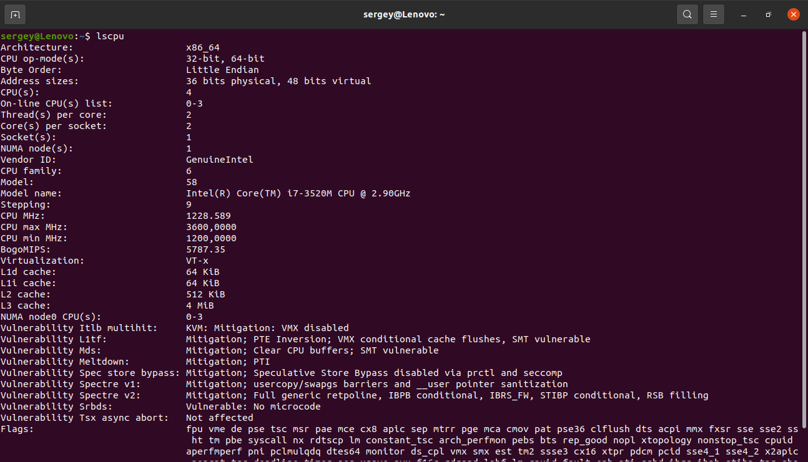
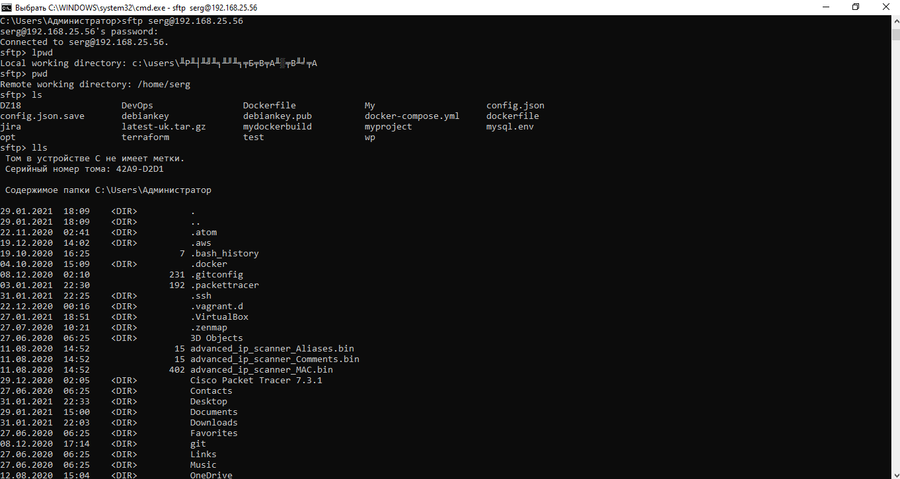

# Module 5 Linux
# TASK 5.3
# Part 1
## 1. How many states could has a process in Linux?
## Linux has basically 5 states:
## Running/Runnable (R)
## Sleeping: Interruptible Sleep (S) and Uninterruptible Sleep (D) 
## SStopped (T)
## Zombie (Z) 

## 3. What is a proc file system?
## The proc filesystem contains a illusionary filesystem. It does not exist on a disk. Instead, the kernel creates it in memory. It is used to provide information about the system .
## 4. Print information about the processor (its type, supported technologies, etc.).

## 5. Use the ps command to get information about the process. The information should be as follows: the owner of the process, the arguments with which the process was launched for execution, the group owner of this process, etc.

## 6. How to define kernel processes and user processes?
## kernel processes

## user processes

## 7. Print the list of processes to the terminal. Briefly describe the statuses of the processes. What condition are they in, or can they be arriving in?

## Statuses of the processes:
## Execution status
## Waiting status
## Ready status
## 8. Display only the processes of a specific user.

## 9. What utilities can be used to analyze existing running tasks (by analyzing the help for the ps command)?
## Can be used: ps, top, htop, atop.
## 10. What information does top command display? 
## Usually, this command shows the summary information of the system and the list of processes or threads which are currently managed by the Linux Kernel.
## 12. Display the processes of the specific user using the top command.

## 12. What interactive commands can be used to control the top command? Give a couple of examples.

## 13. Sort the contents of the processes window using various parameters (for example, the amount of processor time taken up, etc.)

## 14. Concept of priority, what commands are used to set priority?
## command nice
## 15. Can I change the priority of a process using the top command? If so, how?
## command renice
## 16. Examine the kill command. How to send with the kill command process control signal? Give an example of commonly used signals.
## What signal you send will be determined by what results you want from the kill command. For instance, you can send the HUP (hang up) signal to the kill command, which will effectively restart the process. This is always a wise choice when you need the process to immediately restart (such as in the case of a daemon). You can get a list of all the signals that can be sent to the kill command by issuing kill -l. 
## 17. Commands jobs, fg, bg, nohup. What are they for? Use the sleep, yes command to demonstrate the process control mechanism with fg, bg
## jobs, fg, bg - background process management

## Part 2
## 1. Check the implementability of the most frequently used OPENSSH commands in the MS Windows operating system. (Description of the expected result of the commands + screenshots: command – result should be presented)

## 2. Implement basic SSH settings to increase the security of the client-server connection (at least

## 3. List the options for choosing keys for encryption in SSH. Implement 3 of them.
## SSH key-type, rsa, dsa, ecdsa.
## 4. Implement port forwarding for the SSH client from the host machine to the guest Linux virtual machine behind NAT.
## echo 1 | sudo tee /proc/sys/net/ipv4/ip_forward
## sudo sysctl -w net.ipv4.ip_forward=1
## sudo iptables -A FORWARD -i eth0 -o eth1 -p tcp --syn --dport 80 -m conntrack --ctstate NEW -j ACCEPT
## sudo iptables -A FORWARD -i eth0 -o eth1 -m conntrack --ctstate ESTABLISHED,RELATED -j ACCEPT
## sudo iptables -A FORWARD -i eth1 -o eth0 -m conntrack --ctstate ESTABLISHED,RELATED -j ACCEPT
## sudo iptables -P FORWARD DROP
## sudo iptables -t nat -A PREROUTING -i eth0 -p tcp --dport 80 -j DNAT --to-destination 192.168.1.2
## sudo iptables -t nat -A POSTROUTING -o eth1 -p tcp --dport 80 -d 192.168.1.2 -j SNAT --to-source 192.168.1.1
## sudo service iptables-persistent save
## 5*. Intercept (capture) traffic (tcpdump, wireshark) while authorizing the remote client on the server using ssh, telnet, rlogin. Analyze the result.

## ssh it is similar in functionality to the Telnet and rlogin protocols, but, unlike them, encrypts all traffic, including transmitted passwords
