# Module 6 
# TASK 6.1
# VM1
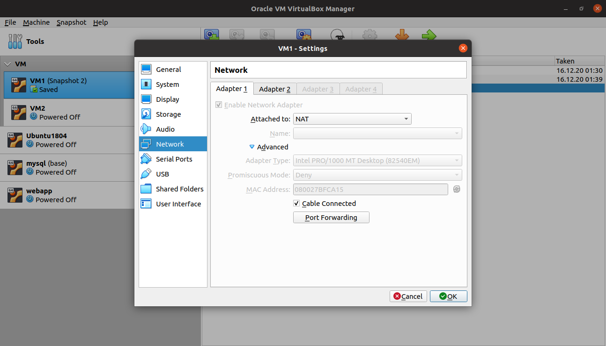
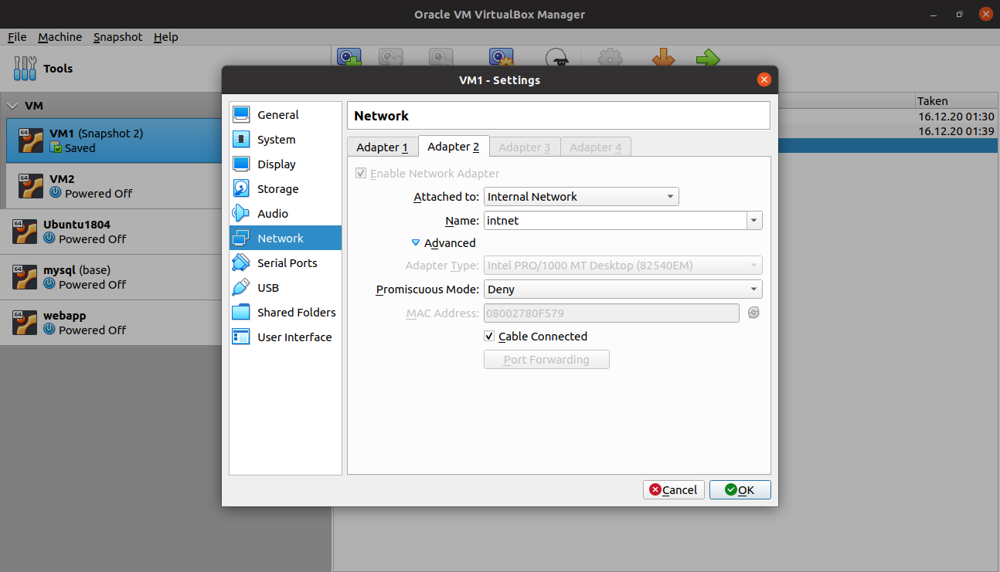
## VM2
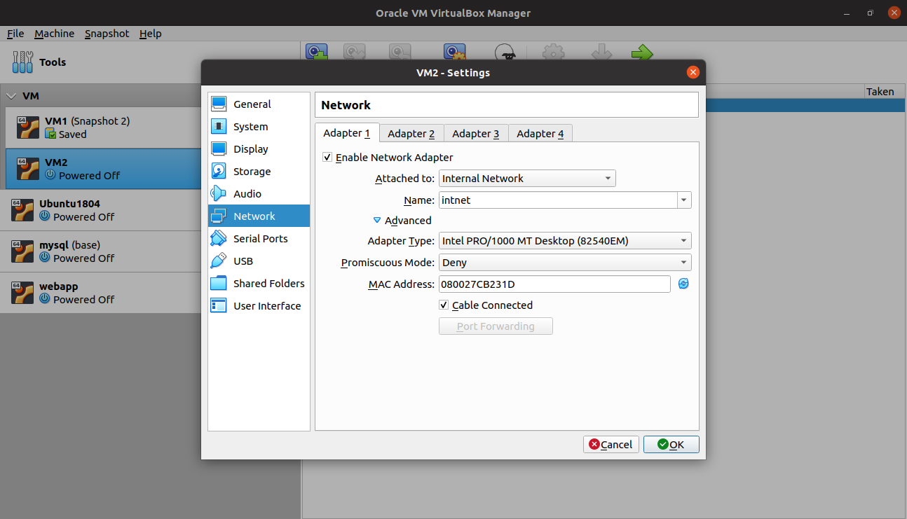
## Configured Network
## Enabled forwarding
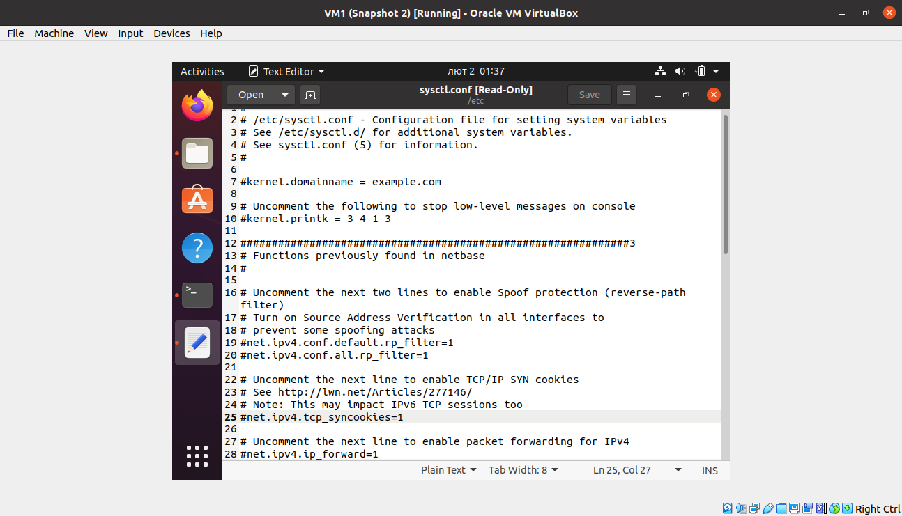
## Set iptables rules
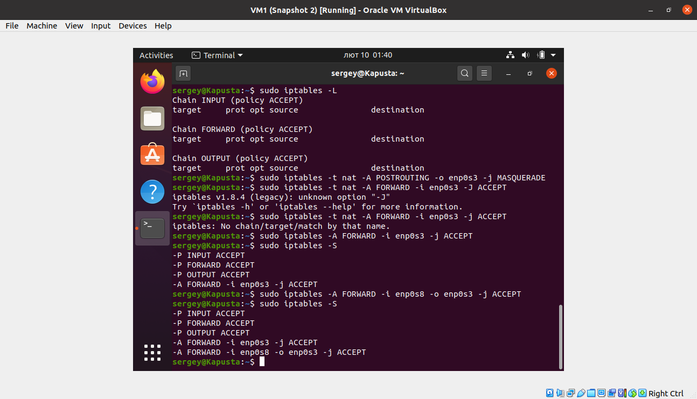
## Set netplan config for vm1
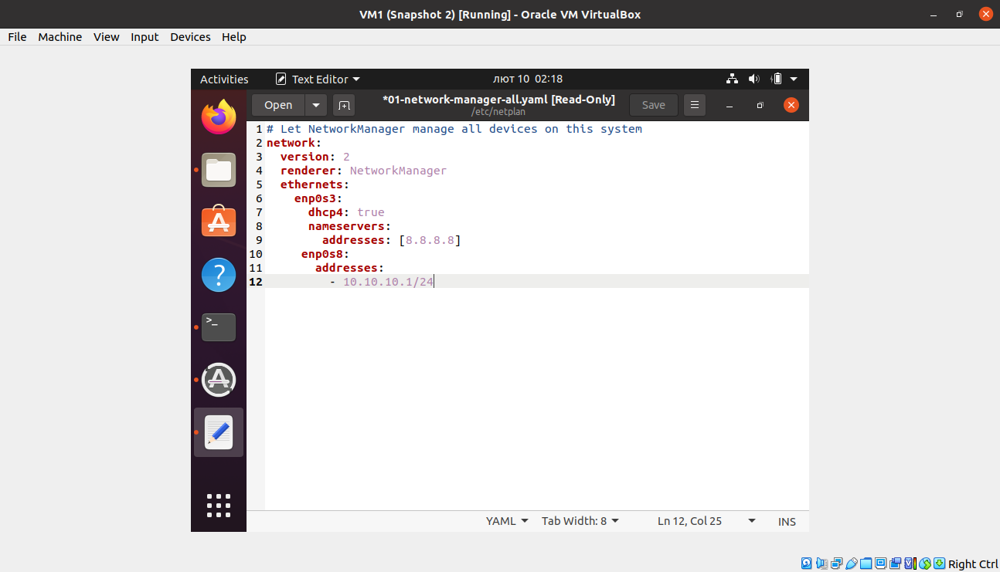
## Set netplan config for vm2
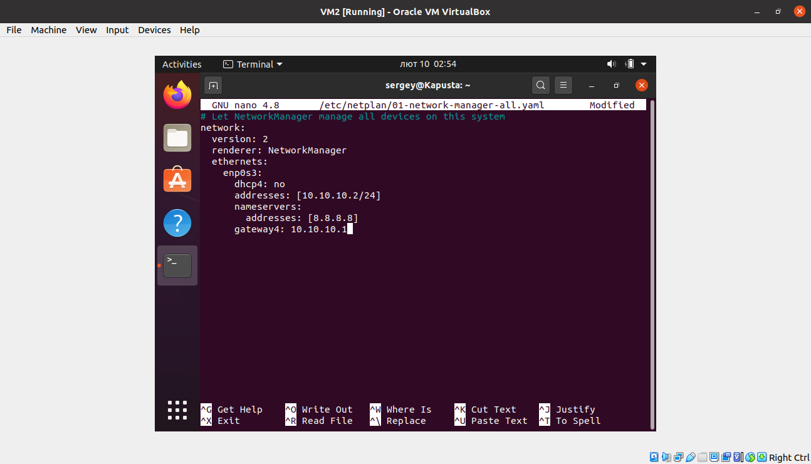
## Connection between VM1 and VM2
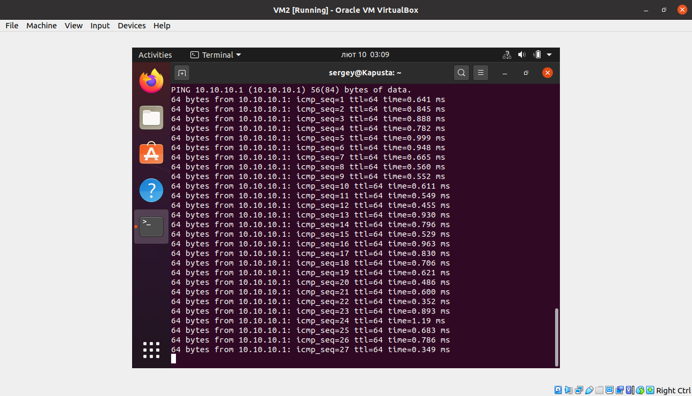
## Subtasks 3-6
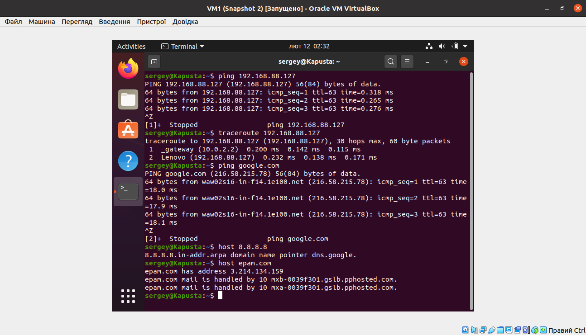
## Subtask 7
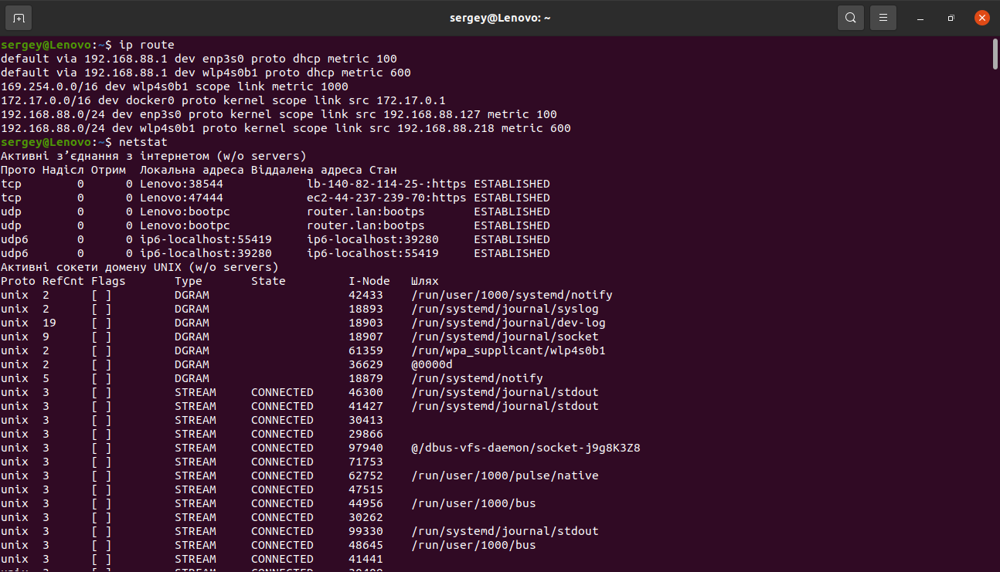
## Subtask 8
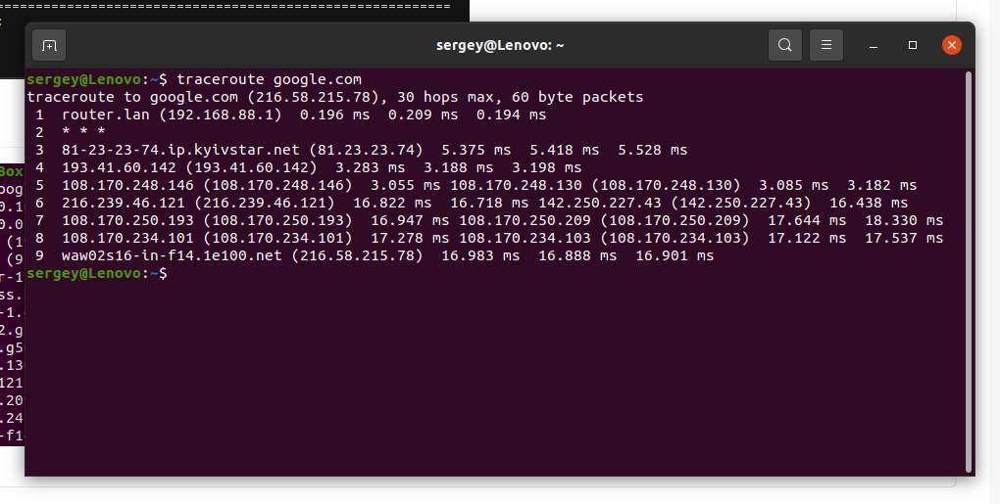
