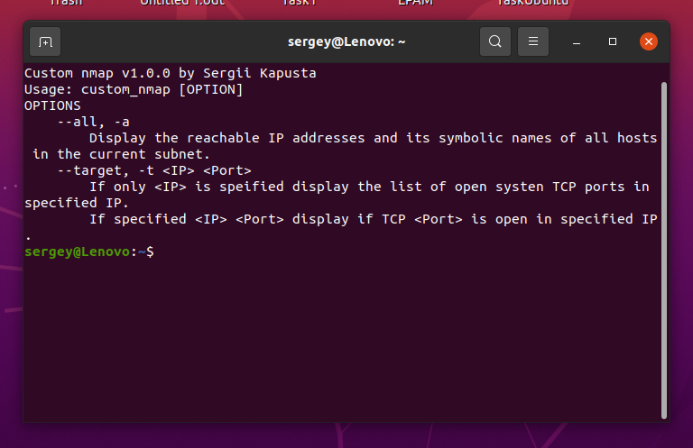
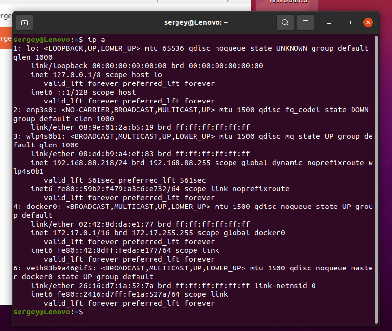
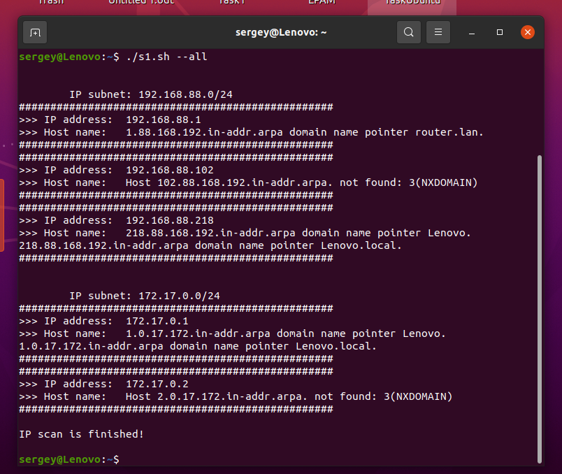
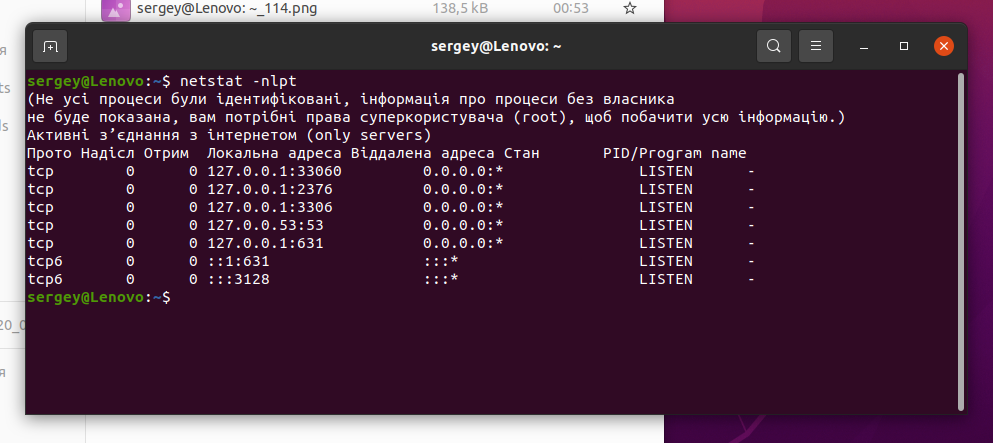

# Module 7 
# TASK 7.1
# 1. When starting without parameters, it will display a list of possible keys and their description.

## 2. The --all key displays the IP addresses and symbolic names of all hosts in the current subnet

## 3. The --target key displays a list of open system TCP ports.

