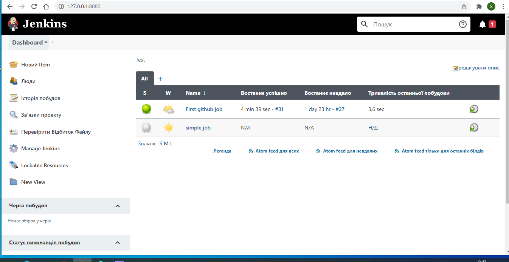
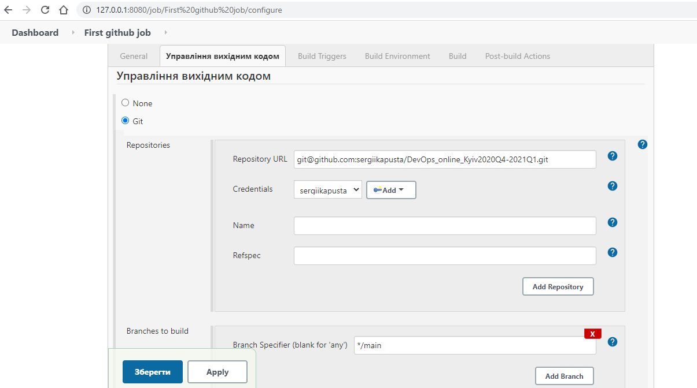
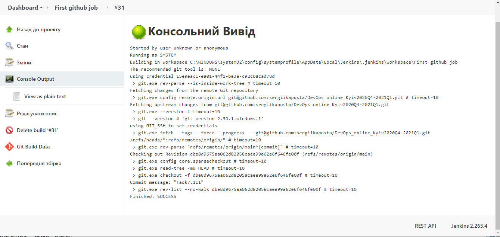
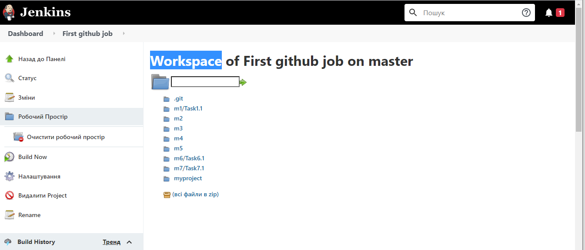
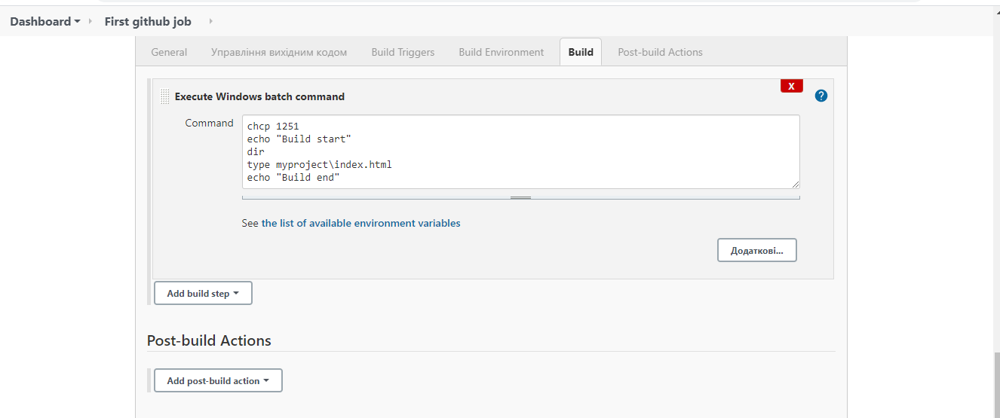
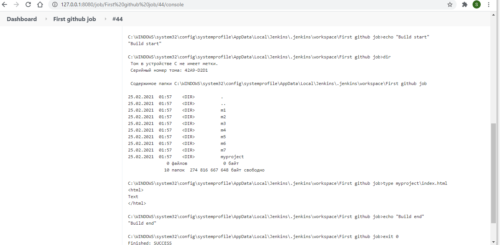
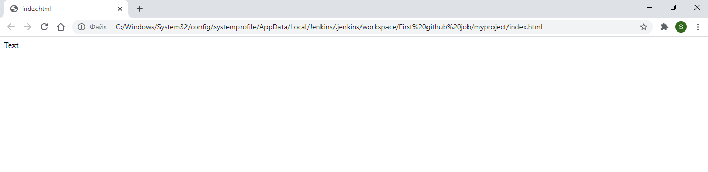

# Module 8
# TASK 8.1 Jenkins Task
## Create some templates using lection materials about Jenkins according your final task. More detailed: choose the content part for your final task (simple web page, web application, etc) and programming language (java, js, python, etc), and type of delivery/deployment mechanism.

