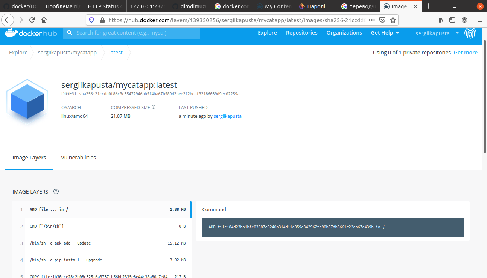

# Module 9
# TASK 9. Docker task description.
## Using docker lection2 create a docker image with Python Flask app that displays random cat pix.
## Create fails

## Docer build

## Mozilla Firefox

## Docker tag

## Docker hub

